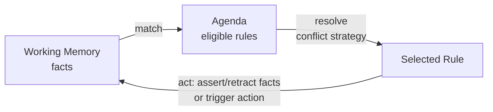

# Syllogist

A lightweight rule-based inference engine written in pure C, supporting forward and backward chaining. No dependencies, no runtime, no garbage collector — just facts, rules, and a match-resolve-act cycle you can trace by hand if you have to.

## Why this exists

Most expert-system tutorials live in Prolog, Python, or Java. This project builds one from the ground up in C — partly as a systems-programming exercise (manual memory management, hand-rolled data structures, a small parser), and partly because the pluggable I/O design means the exact same inference core can eventually be pointed at real sensors and actuators on embedded hardware instead of a console.

If you've used **CLIPS** or **Drools** and wondered what's actually happening under the hood, this project is that, minus the decades of features — small enough to read start to finish in one sitting.

## Core concepts

- **Working memory** — the current set of known facts (`temperature = 32`, `door_open = true`)
- **Rule base** — `IF <conditions> THEN <actions>` rules that read and write working memory
- **Forward chaining** — data-driven: new facts trigger newly-matching rules, repeat until stable
- **Backward chaining** — goal-driven: given a target fact, work backward through rules to see if it can be derived
- **Conflict resolution** — when multiple rules match in one cycle, a strategy (order, specificity, recency) decides which fires
- **Agenda** — the set of rules currently eligible to fire, recomputed each cycle

## Status

Early development. Core data structures and the naive forward-chaining loop are being built first; see [Roadmap](#roadmap).

## How it works

The engine runs a classic **match → resolve → act** cycle:



1. **Match** — scan the rule base, find every rule whose conditions are fully satisfied by current working memory
2. **Resolve** — if more than one rule matches, pick exactly one using a conflict-resolution strategy
3. **Act** — fire the chosen rule: assert new facts, retract old ones, or trigger a side-effecting action (`turn_on(fan)`)
4. Repeat until no rule matches (quiescence) — that's forward chaining done

### Worked example

Given these facts:
```
temperature = 32
humidity = 45
```

and this rule:
```
IF temperature > 30 THEN assert(overheat_risk)
```

Cycle 1: `temperature > 30` matches → `overheat_risk` is asserted into working memory.
Cycle 2: no new rule matches `overheat_risk` yet → engine halts (quiescent).

Add a second rule — `IF overheat_risk AND humidity < 50 THEN alert(dry_heat_warning)` — and cycle 2 fires it instead of halting, since the newly-asserted fact now satisfies it. This chaining of newly-derived facts into newly-eligible rules is the whole point of forward chaining.

### Backward chaining, briefly

Instead of asking "what can I derive from what I know?", backward chaining asks "can I derive this specific goal?" Given a goal like `dry_heat_warning`, the engine looks for rules that conclude it, then recursively tries to satisfy *their* conditions (`overheat_risk`, `humidity < 50`) — treating each as a sub-goal. This is closer to how Prolog resolves queries, and is what turns the engine from purely reactive into something you can interrogate.

## Project layout

```
syllogist/
├── src/
│   ├── main.c
│   ├── fact.c / fact.h        # working memory representation
│   ├── rule.c / rule.h        # rule representation
│   ├── engine.c / engine.h    # match-resolve-act cycle
│   ├── parser.c / parser.h    # text rule-language parser (later milestone)
│   └── io.c / io.h            # pluggable fact-source / action-sink boundary
├── examples/
│   └── thermostat.rules       # sample rule set
├── tests/
├── Makefile
└── README.md
```

## Getting started

### Prerequisites

- GCC or Clang
- `make` (optional, but assumed by the instructions below)
- **Windows users:** WSL2 is recommended for a Linux-standard toolchain; native builds via MinGW/MSVC also work but may need Makefile tweaks

### Build

```bash
git clone https://github.com/thrivecodes/syllogist.git
cd syllogist
make
```

### Build options

Once the Makefile lands, it'll support the usual debug/release split:

```bash
make                 # default build
make DEBUG=1         # -g -O0, assertions on
make SANITIZE=1       # -fsanitize=address,undefined — catches use-after-free,
                      # buffer overruns, and UB early, which matters a lot
                      # once fact/rule storage is hand-rolled linked lists
make clean
```

### Run

```bash
./syllogist examples/thermostat.rules
```

## Rule language

### Example syntax

```
IF temperature > 30 AND humidity > 60 THEN alert(overheat)
IF motion_detected AND time_of_day == "night" THEN turn_on(light)
```

### Grammar (planned, informal EBNF)

```
rule       := "IF" condition_list "THEN" action_list
condition  := IDENTIFIER OPERATOR value
condition_list := condition ("AND" condition)*
action     := IDENTIFIER "(" [value] ")"
action_list := action ("," action)*
operator   := ">" | "<" | ">=" | "<=" | "==" | "!="
value      := NUMBER | STRING | BOOLEAN | IDENTIFIER
```

`OR` and parenthesized grouping are deliberately out of scope for v1 — flat `AND`-only conditions keep the first parser and matcher simple. They're natural follow-on additions once the basic engine works (see [Roadmap](#roadmap)).

Parsed into the internal `Rule` representation by a small recursive-descent parser (`src/parser.c`): a hand-written lexer tokenizes the input, then the parser builds a `Rule` struct per `IF...THEN` block. No parser generator — writing it by hand is part of the exercise.

## Architecture notes

The inference core never talks to `stdin`/`stdout` or hardware directly — it goes through a small `get_fact()` / `do_action()` boundary (`src/io.c`). On a laptop, that boundary is backed by a test harness or console input. When this moves to embedded hardware, only that boundary gets swapped for real GPIO/sensor register access — the engine itself doesn't change.

### Design goals

- **Readable over clever** — a naive O(rules × facts) match loop before any Rete-style optimization
- **No hidden allocations** — anyone reading `engine.c` should be able to see exactly when memory is allocated and freed
- **Hardware-agnostic core** — the engine has no idea whether its facts come from a keyboard or a sensor register
- **Small enough to fully understand** — every module should be readable in one sitting

### Non-goals (for now)

- Performance at scale (no Rete network, no hashing-based joins yet — see Roadmap)
- A full expression language (no arithmetic in conditions beyond simple comparisons)
- Multi-threaded rule evaluation

## Testing

Unit tests live in `tests/`, one file per module (`test_fact.c`, `test_engine.c`, ...), using plain `assert()`-based checks run via a small custom runner — no external test framework dependency, in keeping with the "no dependencies" goal. `make test` will build and run the full suite.

## Roadmap

- [ ] Fact / working memory data structures
- [ ] Naive forward-chaining engine (match-resolve-act)
- [ ] Conflict resolution strategies (order / specificity / recency)
- [ ] Backward chaining (goal-driven queries)
- [ ] Text-based rule language + parser
- [ ] Pluggable I/O boundary with a stub sensor/actuator test harness
- [ ] Hardware integration — real GPIO/sensor input on an embedded target
- [ ] `OR` conditions and parenthesized grouping in the rule language
- [ ] Rete-style incremental matching (avoid re-scanning all rules every cycle)

## FAQ

**Why not just use CLIPS or Drools?**
Because the point is understanding how they work, not shipping a production rules engine. If you need a battle-tested engine, use one of those.

**Why C instead of something with built-in dynamic typing?**
Facts naturally want to hold different value types (numbers, strings, booleans). Building a small tagged-union `Value` type in C is itself a useful exercise, and it's a prerequisite for eventually running this on embedded targets where there's no runtime to lean on.

**Is this production-ready?**
No — it's a learning project, currently in early development.

## Contributing

Personal learning project — issues and PRs welcome once the initial engine lands. If you do contribute: C99, no compiler-specific extensions, one struct + its operations per header/source pair, and please run the sanitizer build before submitting.

## License

MIT
